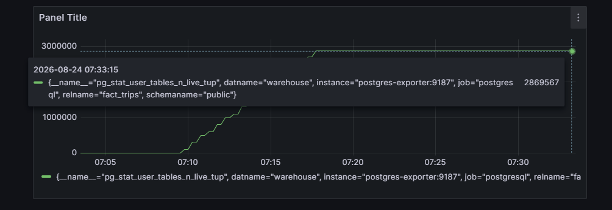
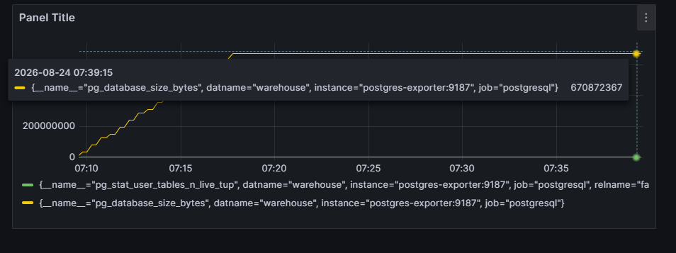
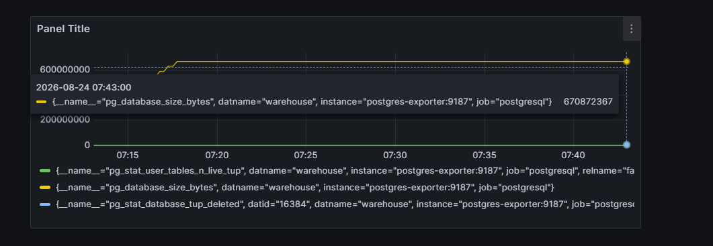
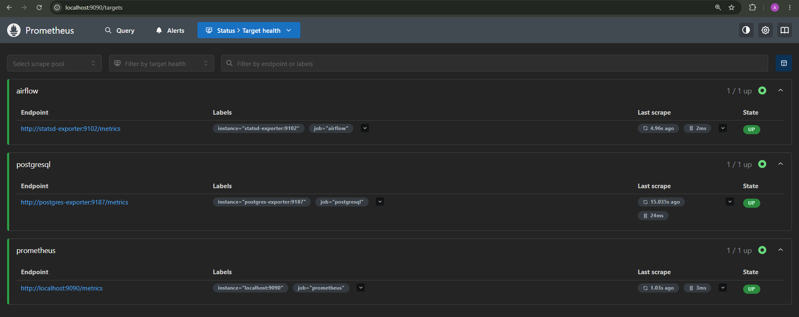

# BatchETL Pipeline

## End-to-End Data Engineering Project with Apache Airflow, PostgreSQL, and Streamlit

[](https://github.com/ArkanTsabit123/BatchETL-Pipeline)
[](https://airflow.apache.org/)
[](https://www.postgresql.org/)
[](https://streamlit.io/)
[](https://grafana.com/)
[](https://prometheus.io/)
[](https://www.terraform.io/)
[](https://python.org/)
[](LICENSE)
[](https://batchetl.streamlit.app)
[](docs/verification-checklist.md)

---

## Project Overview

BatchETL Pipeline is a production-ready data engineering project that demonstrates an end-to-end ETL pipeline for NYC Taxi trip data. The pipeline extracts data from CSV files, transforms it using Pandas, loads it into PostgreSQL, and visualizes insights through an interactive Streamlit dashboard. The project includes comprehensive monitoring with Grafana and Prometheus, enterprise-grade AWS cloud deployment, and Infrastructure as Code with Terraform.

### Key Highlights

- **2.96+ Million Rows** processed from NYC Taxi trip data
- **Automated ETL Pipeline** with data cleaning, deduplication, and outlier removal
- **Interactive Dashboard** with 5 KPIs, 4 charts, and 5 filters
- **Containerized Deployment** using Docker Compose
- **Apache Airflow Orchestration** with daily scheduling
- **Real-time Monitoring** with Grafana and Prometheus
- **Enterprise Cloud Deployment** on AWS (RDS, MWAA, S3)
- **Infrastructure as Code** with Terraform
- **Live Demo** on Streamlit Cloud

### Quick Stats

| Metric | Value |
|--------|-------|
| Input Rows | 2,964,624 |
| Output Rows | 2,869,525 |
| Execution Time | 15-25 seconds |
| Dashboard KPIs | 5 |
| Charts | 4 |
| Filters | 5 |
| Screenshots | 30 |
| Verification Checks | 199 |
| Monitoring Tools | 3 (Grafana, Prometheus, PostgreSQL Exporter) |
| AWS Services | 5 (RDS, MWAA, S3, CloudWatch, Secrets Manager) |
| Terraform Modules | 5 |

---

## Live Demo

### Streamlit Cloud Dashboard

[https://batchetl.streamlit.app](https://batchetl.streamlit.app)

The dashboard is deployed on Streamlit Cloud with 100,000 rows of sample data for fast and responsive performance.

**Features:**
- 5 KPIs: Total Trips, Average Fare, Avg Distance, Avg Passengers, Total Revenue
- 4 Charts: Revenue by Day, Trips per Hour, Fare Distribution, Distance vs Fare
- 5 Filters: Fare Range, Distance Range, Day of Week, Payment Type, Vendor ID
- Sample data: 100,000 rows of NYC Taxi trip records

---

## Technology Stack

| Layer | Technology | Version |
|-------|------------|---------|
| Orchestration | Apache Airflow | 2.7.3 |
| Containerization | Docker Compose | 3.8 |
| Database | PostgreSQL | 15 |
| Data Processing | Pandas | 2.0.3 |
| Dashboard | Streamlit | 1.29.0 |
| Visualization | Plotly | 5.18.0 |
| Database Adapter | SQLAlchemy | 2.0.19 |
| **Monitoring** | **Grafana** | **10.2.0** |
| **Metrics Collection** | **Prometheus** | **2.47.0** |
| **PostgreSQL Exporter** | **Prometheus Community** | **Latest** |
| **Infrastructure as Code** | **Terraform** | **1.5.0** |
| **Cloud Data Lake** | **Amazon S3** | **N/A** |
| **Managed Airflow** | **Amazon MWAA** | **2.7.3** |
| **Managed Database** | **Amazon RDS** | **15** |
| **Cloud Monitoring** | **Amazon CloudWatch** | **N/A** |
| **Secret Management** | **AWS Secrets Manager** | **N/A** |
| Python | Python | 3.10+ |

---

## System Architecture

### Architecture Diagram


### Data Flow Diagram


### Entity Relationship Diagram


### Monitoring Architecture



---

## Quick Start

```bash
# Clone repository
git clone https://github.com/ArkanTsabit123/BatchETL-Pipeline.git
cd BatchETL-Pipeline

# Start all containers (including monitoring)
docker-compose up -d

# Verify containers are running
docker-compose ps

# Access Airflow UI
# http://localhost:8080 (admin/admin)

# Access Dashboard
# http://localhost:8501

# Access Grafana
# http://localhost:3000 (admin/admin)

# Access Prometheus
# http://localhost:9090

# Trigger the DAG
# Airflow UI -> etl_pipeline -> Trigger DAG
```

---

## Deployment Guide

```bash
# 1. Clone repository
git clone https://github.com/ArkanTsabit123/BatchETL-Pipeline.git
cd BatchETL-Pipeline

# 2. Create virtual environment
python -m venv venv
source venv/bin/activate  # Windows: venv\Scripts\activate

# 3. Install dependencies
pip install -r requirements.txt

# 4. Start containers
docker-compose up -d

# 5. Verify containers
docker-compose ps

# 6. Access Airflow UI
# http://localhost:8080 (admin/admin)

# 7. Run ETL manually (optional)
python scripts/extract.py
python scripts/transform.py
python scripts/load.py

# 8. Launch Dashboard
# http://localhost:8501

# 9. Access Monitoring
# http://localhost:3000 (Grafana - admin/admin)
# http://localhost:9090 (Prometheus)

# 10. Run verifications
python run_all_verifications.py
```

---

## Dashboard Features

### KPI Cards

| KPI | Calculation | Display Format |
|-----|-------------|----------------|
| Total Trips | `COUNT(*)` | `{value:,}` |
| Average Fare | `AVG(fare_amount)` | `${value:.2f}` |
| Avg Distance | `AVG(trip_distance)` | `{value:.2f} miles` |
| Avg Passengers | `AVG(passenger_count)` | `{value:.1f}` |
| Total Revenue | `SUM(total_amount)` | `${value:,.2f}` |

### Charts

| Chart | Type | Description |
|-------|------|-------------|
| Revenue by Day | Bar Chart | Revenue distribution across days |
| Trips per Hour | Bar Chart | Trip volume by hour of day |
| Fare Distribution | Histogram | Distribution of fare amounts |
| Distance vs Fare | Scatter Plot | Relationship between distance and fare |

### Filters

| Filter | Type | Options |
|--------|------|---------|
| Fare Range | Slider | Min-Max from data |
| Distance Range | Slider | Min-Max from data |
| Day of Week | Multiselect | Monday-Sunday |
| Payment Type | Selectbox | 1-6 |
| Vendor ID | Selectbox | 1-2 |

---

## Monitoring & Observability
### Grafana & Prometheus Screenshots

| Dashboard | Description |
|-----------|-------------|
|  | **Pipeline Overview**: Total rows in fact_trips (2.87M rows) |
|  | **Database Performance**: Database size (670MB) |
|  | **Data Quality**: Data quality metrics |
|  | **Prometheus Targets**: All targets UP |

### Grafana Dashboards

| Dashboard | Description |
|-----------|-------------|
| **Pipeline Overview** | DAG success rate, task duration, rows processed |
| **Database Performance** | Connections, transactions, cache hit ratio |
| **Data Quality** | Outliers, nulls, duplicates, quality score |

### Prometheus Metrics

| Source | Metrics |
|--------|---------|
| Airflow | task_duration_seconds, task_state, dag_run_duration_seconds |
| PostgreSQL | pg_stat_database_tup_returned, tup_inserted, numbackends |
| Custom | etl_rows_processed, etl_outliers_removed, etl_duplicates_removed |

### Alerting Rules

| Alert | Severity |
|-------|----------|
| DAGFailed | Critical |
| PipelineDelayed | Warning |
| DataVolumeDrop | Warning |
| DatabaseConnectionsHigh | Warning |
| DataQualityLow | Warning |
| DatabaseCacheHitLow | Warning |

### Monitoring URLs

| Service | URL | Credentials |
|---------|-----|-------------|
| Prometheus | http://localhost:9090 | None |
| Grafana | http://localhost:3000 | admin/admin |
| PostgreSQL Exporter | http://localhost:9187/metrics | None |

---

## Verification System

### 11-Phase Verification

| Phase | Name | Checks | Status |
|-------|------|--------|--------|
| 1 | Setup & Environment | 16 | 100% |
| 2 | Docker & Container Setup | 18 | 100% |
| 3 | Airflow DAG Creation | 12 | 100% |
| 4 | Pipeline Execution | 13 | 100% |
| 5 | PostgreSQL Data Verification | 14 | 100% |
| 6 | Dashboard Verification (Local) | 23 | 100% |
| 7 | Screenshots Documentation | 30 | 100% |
| 8 | Documentation & Deployment | 21 | 100% |
| 9 | Streamlit Cloud Deployment | 23 | 100% |
| 10 | Monitoring Verification | 14 | 100% |
| 11 | AWS + Terraform Verification | 15 | 100% |
| **TOTAL** | **All Phases** | **199** | **100%** |

```bash
# Run all verifications
python run_all_verifications.py

# Individual verification
python verify-phase-1.py
python verify-phase-2.py
# ... up to verify-phase-11.py
```

---

## AWS Cloud Deployment (Enterprise)

### AWS Services Used

| Service | Purpose |
|---------|---------|
| Amazon RDS (PostgreSQL) | Managed data warehouse |
| Amazon MWAA | Managed Airflow orchestration |
| Amazon S3 | Data lake storage |
| AWS Secrets Manager | Credential management |
| Amazon CloudWatch | Logging and monitoring |

### Cost Estimation

| Service | Monthly Cost |
|---------|--------------|
| RDS PostgreSQL (db.t4g.medium) | ~$80 |
| MWAA (mwaa.medium) | ~$50 |
| S3 Storage (500 GB) | ~$12.50 |
| Data Transfer (100 GB) | ~$9 |
| **Total** | **~$151.50** |

---

## Terraform Infrastructure as Code

### Modules

| Module | Description |
|--------|-------------|
| rds | PostgreSQL database with Multi-AZ support |
| mwaa | Managed Airflow environment |
| s3 | Data lake bucket with lifecycle policies |
| networking | VPC, subnets, security groups |
| monitoring | CloudWatch and Prometheus |

### Environments

| Environment | Instance Class | Multi-AZ |
|-------------|----------------|----------|
| dev | db.t4g.small | No |
| staging | db.t4g.medium | No |
| prod | db.t4g.large | Yes |

---

## Quick Commands

```bash
# START SERVICES (including monitoring)
docker-compose up -d

# START MONITORING ONLY
docker-compose up -d prometheus grafana postgres-exporter

# STATUS
docker-compose ps

# LOGS
docker-compose logs -f

# LOGS - MONITORING
docker-compose logs prometheus -f
docker-compose logs grafana -f

# STOP SERVICES
docker-compose down

# RESET
docker-compose down -v && docker-compose up -d

# AIRFLOW UI
http://localhost:8080 (admin/admin)

# DASHBOARD
http://localhost:8501

# GRAFANA
http://localhost:3000 (admin/admin)

# PROMETHEUS
http://localhost:9090

# POSTGRES CONNECT
docker exec -it batch-etl-postgres psql -U admin -d warehouse

# TRIGGER DAG
docker exec -it batch-etl-airflow airflow dags trigger etl_pipeline

# CHECK DATA
docker exec -it batch-etl-postgres psql -U admin -d warehouse -c "SELECT COUNT(*) FROM fact_trips;"

# CHECK PROMETHEUS TARGETS
curl http://localhost:9090/api/v1/targets

# CHECK GRAFANA HEALTH
curl http://localhost:3000/api/health

# TERRAFORM PLAN
cd terraform && terraform plan -var-file="environments/dev/terraform.tfvars"

# TERRAFORM APPLY
terraform apply -var-file="environments/dev/terraform.tfvars" -auto-approve

# RUN SCRIPTS MANUALLY
python scripts/extract.py && python scripts/transform.py && python scripts/load.py

# RUN VERIFICATIONS
python run_all_verifications.py

# DOCKER CLEANUP
docker system prune -f
```

---

## Documentation

For complete project documentation, please refer to the `/docs/` directory:

| File | Purpose |
|------|---------|
| [blueprint.md](/docs/blueprint.md) | Technical blueprint |
| [cheatsheets.md](/docs/cheatsheets.md) | Quick reference commands |
| [verification-checklist.md](/docs/verification-checklist.md) | Testing checklist |
| [CHANGELOG.md](/CHANGELOG.md) | Release history |

---

## Performance

| Metric | Value |
|--------|-------|
| Input Rows | 2,964,624 |
| Output Rows | 2,869,525 |
| Extract Time | 43 seconds |
| Transform Time | 27 seconds |
| Load Time | 4-5 minutes |
| **Total Time** | **5-6 minutes** |
| PostgreSQL Size | ~300 MB |

---

## Business Value

| Metric | Before | After |
|--------|--------|-------|
| Report generation | 2+ hours manual | 5 minutes automated |
| Data freshness | Daily manual | Fully automated daily |
| Human error risk | High | Eliminated |
| Decision-making latency | High | Low (instant access) |
| Monitoring visibility | None | Real-time dashboards |
| Infrastructure management | Manual | Automated (IaC) |
| Cloud readiness | None | Production-grade AWS |

---

## Troubleshooting

### Common Issues and Solutions

| Issue | Solution |
|-------|----------|
| Docker container not starting | Check Docker Desktop is running, verify ports are available |
| Airflow DAG not appearing | Wait 30-60 seconds, restart Airflow container |
| Task stuck in running | Clear task from UI or CLI, retry |
| Database connection refused | Wait for database to initialize (10-15 seconds) |
| No data in dashboard | Run ETL scripts or trigger DAG first |
| Port already in use | Change port in docker-compose.yml |
| Grafana no data | Check Prometheus targets, verify data source |
| Prometheus targets down | Check service health, network connectivity |
| Terraform apply fails | Check AWS credentials, IAM permissions |

### Logs and Debugging

```bash
# View all container logs
docker-compose logs -f

# View specific container logs
docker-compose logs airflow -f
docker-compose logs postgres -f
docker-compose logs streamlit -f
docker-compose logs prometheus -f
docker-compose logs grafana -f

# Check container status
docker-compose ps

# Full reset
docker-compose down -v && docker-compose up -d
```

---

## Security Considerations

### Default Credentials (Change for Production)

| Service | Username | Password |
|---------|----------|----------|
| Airflow UI | admin | admin |
| PostgreSQL | admin | admin |
| Grafana | admin | admin |

### Network Ports

| Port | Service | Exposure |
|------|---------|----------|
| 8080 | Airflow UI | Localhost |
| 5432 | PostgreSQL | Localhost |
| 8501 | Dashboard | Localhost |
| 9090 | Prometheus | Localhost |
| 3000 | Grafana | Localhost |
| 9187 | PostgreSQL Exporter | Localhost |

### AWS Security Checklist

| Security Measure | Status |
|------------------|--------|
| VPC with private subnets | ✅ |
| Security groups with least privilege | ✅ |
| RDS encryption at rest | ✅ |
| S3 encryption at rest (SSE-S3) | ✅ |
| IAM roles for service access | ✅ |
| Secrets Manager for credentials | ✅ |
| CloudTrail enabled | ✅ |
| VPC Flow Logs enabled | ✅ |

### Security Best Practices

1. Never expose ports to public internet in production
2. Change all default credentials before production deployment
3. Use environment variables for sensitive data
4. Implement network isolation using Docker networks
5. Regularly update Docker images for security patches
6. Use AWS Secrets Manager for production credentials
7. Enable encryption at rest (RDS, S3, EBS)
8. Implement least-privilege IAM policies
9. Enable CloudTrail for audit logging
10. Use VPC with private subnets for production

---

## Quick Links

| Resource | URL |
|----------|-----|
| **Live Demo** | https://batchetl.streamlit.app |
| **Airflow UI** | http://localhost:8080 |
| **Dashboard (Local)** | http://localhost:8501 |
| **Grafana** | http://localhost:3000 |
| **Prometheus** | http://localhost:9090 |
| **NYC Taxi Data** | https://www.nyc.gov/site/tlc/about/tlc-trip-record-data.page |
| **Airflow Docs** | https://airflow.apache.org/docs/ |
| **PostgreSQL Docs** | https://www.postgresql.org/docs/ |
| **Streamlit Docs** | https://docs.streamlit.io/ |
| **Plotly Docs** | https://plotly.com/python/ |
| **Grafana Docs** | https://grafana.com/docs/ |
| **Prometheus Docs** | https://prometheus.io/docs/ |
| **Terraform Docs** | https://developer.hashicorp.com/terraform/docs |
| **AWS RDS Docs** | https://docs.aws.amazon.com/rds/ |
| **AWS MWAA Docs** | https://docs.aws.amazon.com/mwaa/ |

---

## License

This project is licensed under the MIT License. See the [LICENSE](LICENSE) file for details.

---

## Acknowledgments

- NYC Taxi & Limousine Commission for providing the data
- Apache Airflow, PostgreSQL, Streamlit, and all open-source tools used
- Grafana, Prometheus, Terraform, and AWS for enterprise-grade capabilities

---

## Contact

- **Project Maintainer**: Arkan Tsabit
- **GitHub**: https://github.com/ArkanTsabit123
- **LinkedIn**: https://linkedin.com/in/arkan-tsabit

---

Built by Arkan Tsabit | Data Engineer